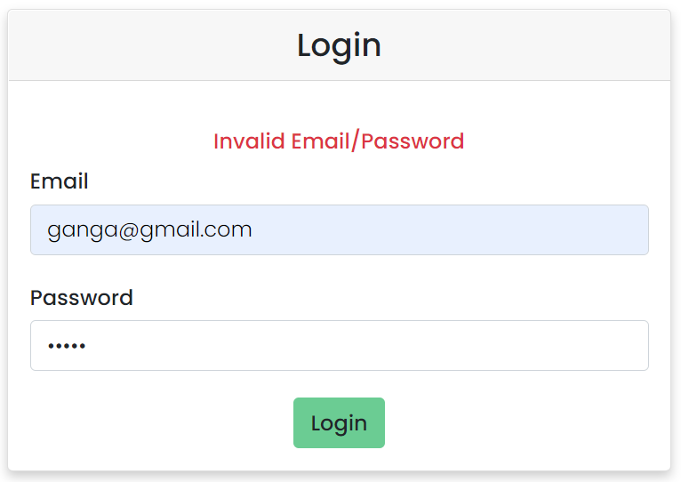

# Parcel Delivery System

<h style="font-size:30px"><strong>Step 1:</strong> Register</h>

 

    
    
    

 

<h style="font-size:30px"><strong>Step 2:</strong> Verify OTP</h>

    
    
    

 

<h style="font-size:30px"><strong>Step 3:</strong> Login</h>

 

    
    

     

<h style="font-size:30px"><strong>Step 4:</strong> Update Profile</h>

 

    
    

    

<h style="font-size:30px"><strong>Step 5:</strong> Place Order</h>

    

    
    

    
    

    
 
<h style="font-size:30px"><strong>Step 6:</strong> Track Orders</h>

 
    
     
     
    

   
